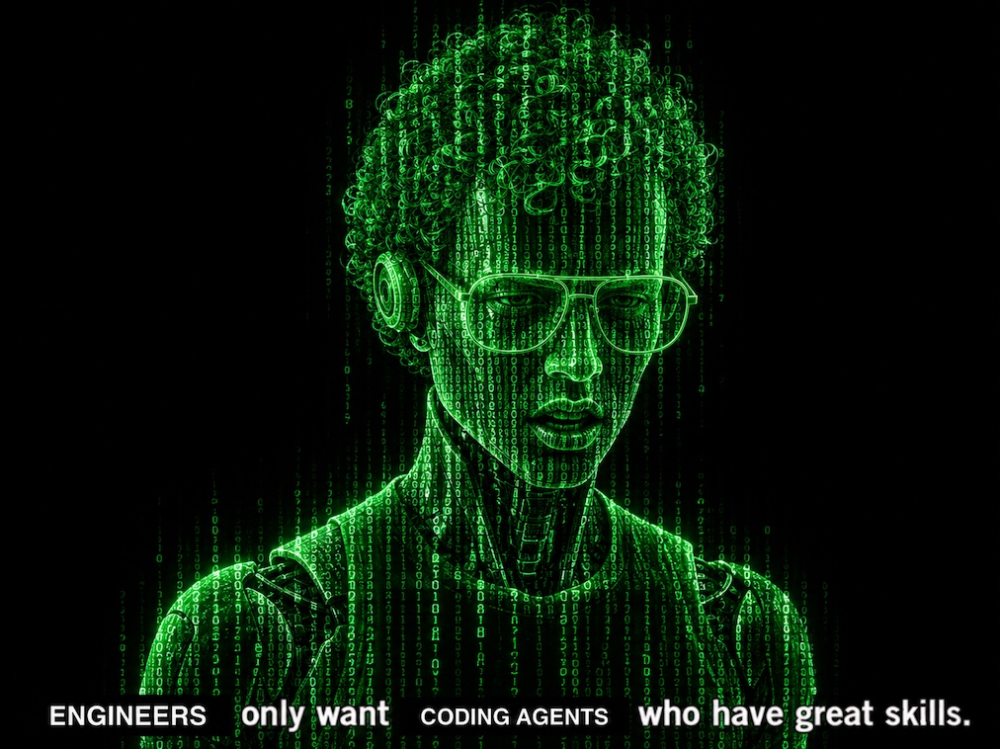
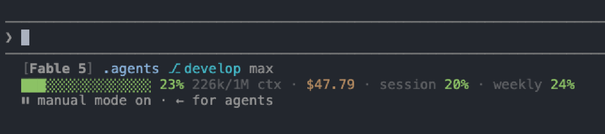
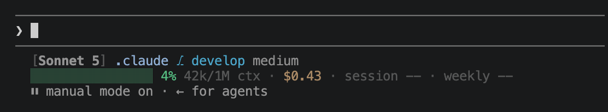
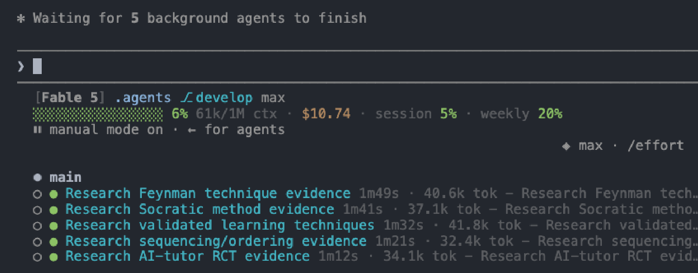
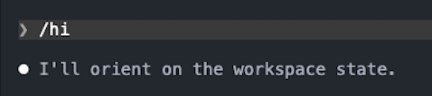
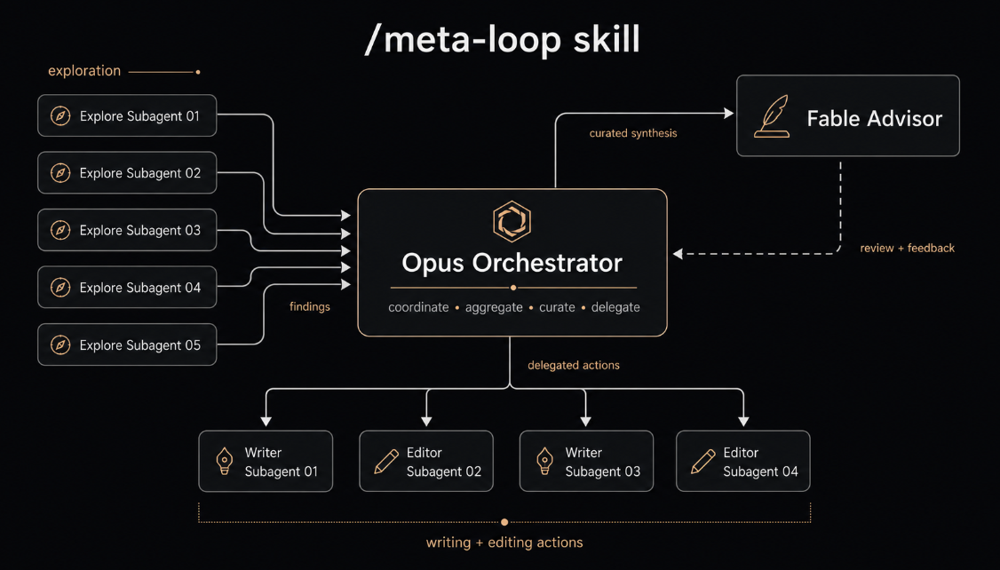
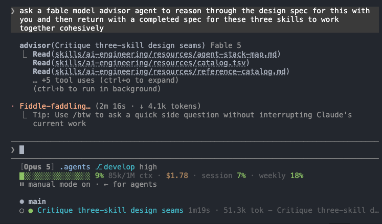
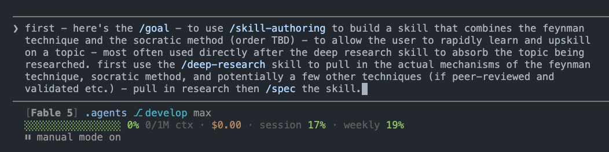

<div align="center">

# `~/.agents`

**devs only want agents who have great SKILLs**

[](LICENSE)
[](https://agentskills.io)



</div>

This repo is a portable set of agent SKILLs, written to the open
[Agent Skills](https://agentskills.io) standard - compatible with Claude Code,
Codex CLI, Cursor, copilot, kimi, deepagents, goose, and most other agent harnesses.
The repo also contains subagents,
slash commands, and specific agent framework / harness setup notes in [`specs/`](specs/).

Getting started is one clone:

```bash
git clone <this-repo> ~/.agents
```

Most tools find the skills there automatically. The table below lists what
each one reads and the two that need one extra step.

## Supported agent frameworks

`~/.agents/skills/` is the cross-harness convention, so **most harnesses read this
repo directly, with no install step.**

| Harness | Setup | Spec |
|---|---|---|
| **Claude Code** | `sync-skills.sh` | [SPEC-CLAUDE-CODE](specs/claude-code/SPEC-CLAUDE-CODE.md) |
| **Antigravity CLI** | one `skills.json` | [SPEC-ANTIGRAVITY](specs/antigravity/SPEC-ANTIGRAVITY.md) |
| **Codex CLI** | none | [SPEC-CODEX](specs/codex/SPEC-CODEX.md) |
| **GitHub Copilot** | none | [SPEC-COPILOT](specs/copilot/SPEC-COPILOT.md) |
| **Cursor** | none | [SPEC-CURSOR](specs/cursor/SPEC-CURSOR.md) |
| **deepagents** | passed in code | [SPEC-DEEPAGENTS](specs/deepagents/SPEC-DEEPAGENTS.md) |
| **Gemini CLI** | none | [SPEC-GEMINI](specs/gemini/SPEC-GEMINI.md) |
| **goose** | none | [SPEC-GOOSE](specs/goose/SPEC-GOOSE.md) |
| **Kimi Code CLI** | none | [SPEC-KIMI](specs/kimi/SPEC-KIMI.md) |
| **opencode** | none | [SPEC-OPENCODE](specs/opencode/SPEC-OPENCODE.md) |
| **Pi** | none | [SPEC-PI](specs/pi/SPEC-PI.md) |

Two need a setup step. Claude Code takes [`sync-skills.sh`](#for-agents), which
symlinks the skills, subagents and commands into `~/.claude` without touching
anything already there. Antigravity reads `.agents/` per project but not
`~/.agents/` globally, and takes a one-entry pointer file instead. Full paths,
per-harness caveats and what does *not* carry over are under
[For agents](#for-agents).

> **[`specs/`](specs/) is the other half of this repo.** Skills are portable, but
> a skill does nothing until a harness is set up to run it. Each station spec says
> what one harness needs around these skills: config, plugins, CLI dependencies,
> hooks, permission rules. [`SPEC-CLAUDE-CODE.md`](specs/claude-code/SPEC-CLAUDE-CODE.md) is the fullest
> because Claude Code is the opinionated first choice. Start there when setting up.

<div align="center">

</div>

## One tooling layer, many agents at once

The harness table above is not an either/or menu. Because every harness reads
the same `~/.agents/skills/` tree, concurrent sessions in *different* harnesses
share one skillset - a Claude Code session, a Cursor session and a Copilot
session running side by side all draw on the same skills, and the repo-root
[`AGENTS.md`](AGENTS.md) gives them the same working rules. The
[`agent-mail`](skills/agent-mail/SKILL.md) skill adds the channel between them:
file-based messages between agents working separate repos on the same machine,
with no daemon and no network. Cursor sessions pick up the same subagents
through the per-repo seed (`sync-skills.sh --cursor`).

This is proven in practice, not aspirational: multiple harnesses have been
seated as live sessions in one group-chat thread - each a real session with its
own working directory and permissions - reasoning together and coding against
real repos, all running on the tooling in this repo. Applications that want to
be self-contained can carry copies of individual skills or engines, published
from here at a recorded commit; when this repo is present, sessions simply read
it live and no copy is needed.

## Watching the work

**Status line.** `statusline.sh` renders model, cwd, branch, reasoning effort,
context, tokens, session cost, and rate-limit consumption on every prompt;
`subagent-statusline.sh` adds a row per running background task. Setup: copy both
from [`specs/claude-code/`](specs/claude-code/) to `~/.claude/`, make them
executable, and wire them into `settings.json`'s `statusLine` /
`subagentStatusLine`. [Section 9](specs/claude-code/SPEC-CLAUDE-CODE.md) covers what each field means.

The scripts format values Claude Code hands them and calculate nothing. Two are
easy to misread. The dollar figure (`cost.total_cost_usd`) estimates what the
session would cost at API rates, subagents included - on a subscription that is
not money billed, and it resets on `/clear`. The percentages are the 5-hour and
7-day rate-limit windows, which on a Max or Pro plan are the real constraint.

Three examples below: an expensive session (Fable 5, max effort, 226k context,
$47.79), a cheap one (Sonnet 5, medium effort, 42k context, 43 cents), and the
subagent panel during a parallel run.





## Skills in action

The screenshots below come from real sessions.

**`/hi`, first thing.** Every session opens with
[`/hi`](skills/hi/SKILL.md), which reads the workspace's living docs, memory,
changelog and git status, then reports where things stand and names the single
next action. It is read-only and writes nothing.



**[`meta-loop`](skills/meta-loop/SKILL.md), the shape of a long session.** A
purpose-driven set of explore subagents searches in parallel and hands findings
to the orchestrator, which curates them into a synthesis, sends that to the
[`advisor`](agents/advisor.md) for review, then delegates the writing and editing
to a second wave of subagents. How many of each depends on the work.



Each subagent reads in its own context window and returns only its conclusions,
so the orchestrator collects findings rather than the searching that produced
them. That is what lets a session go deep without the main thread filling up.
Each result is checked against acceptance criteria and evidence rather than the
worker's own summary.

Workers run at the session's own model tier by default, which keeps results
consistent for high-stakes coding; a smaller model is a reasonable choice for a
delegated subtask that does not need the larger one. Either way the tier is
written into each call rather than inherited, so neither a cheap session nor an
expensive one silently decides it for you.

The token saving does not come from that choice, though. It comes from the shape:
no single agent fills a full context window, so several shorter threads cost less
in aggregate than one long thread that maxes out and compacts repeatedly.

The next two shots are that advisor step in a real session: it grounds itself in
the `ai-engineering` corpus, and the main agent checks its finding against the
data before acting on it.




**Building a skill with `deep-research`.** These shots are the `teach-me` skill
being *built*, not used. Parallel researchers fan out one per angle to gather the
learning-science evidence, dating and citing every claim; the skill is then
written spec-first, with its trigger evals authored before any of its prose
exists.




**`reflect` -> `notes`.** `/reflect` reconciles truth and waits for approval
before writing; only then does `/notes` file the session.


## Which harness, and which model

The skills are harness-neutral; where you run them is a separate choice.

| Harness | Notes |
|---|---|
| **Claude Code** | The first-round option most of the time, and the only one that reads the full skills + subagents + commands set |
| **Codex CLI** | Broad everyday coverage |
| **Cursor** | The IDE lane, and the only other harness that picks up the subagents |
| **GitHub Copilot** | The VS Code lane, editor and CLI off one config root |
| **goose** | Fully open source, with a desktop GUI and mature governance |
| **Kimi Code CLI** | Broad everyday coverage |
| **opencode** | Open source and provider-agnostic; `opencode debug skill` is the quickest check that a skill parses |
| **Pi** | Minimal and hackable, for building a bespoke loop |

Match the model to what the work is worth rather than to the harness. Hosted
third-party models are fine for everyday work; anything load-bearing runs on
models you trust with the material.

Worth noting: **an Ollama `:cloud` model is not a local model.** It is served
remotely and carries the same exposure as any hosted API, whatever the
local-feeling command looks like. `ornith:9b` and `gpt-oss:20b` are local;
`kimi-k2.6:cloud` is not.

Harnesses that take multiple providers can be pointed wherever you like. goose
defaults to `glm-5.2` through Ollama cloud here, which is a default rather than a
constraint.

> **Ollama is reached through the Ollama app, never its public HTTP API.**
> `OLLAMA_HOST` is never set to `0.0.0.0` or any routable address, on any machine,
> for any reason. Binding the model server off loopback publishes an
> unauthenticated inference endpoint to the network.

## Design principles

**Every skill here fixes something the model gets wrong on its own.**
`frontend-aesthetics` because default UI taste is bad. `django` because DRF's
permission default fails open. `docker` because host escapes get handed out like
candy. There is no generalized backend skill, because there is no generalized
backend mistake to correct, and a skill that only repeats what the model already
knows never fires anyway.

**Prose does not stop an agent from doing anything.** Tell a subagent it is
read-only and hand it `Bash`, and it will edit your files. Advisory agents get a
read-only `tools:` allowlist instead, because that is the only part the harness
actually enforces.

**Nothing grades its own homework.** A checklist run by the model that wrote the
code is theater. So the mechanically checkable parts ship as scripts that exit
non-zero: `slop_check.py` for machine-writing tells, `docker_check.py` for
compose host escapes, `django_check.py` for the fail-open defaults,
`unicode_smuggle_check.py` for instructions hidden in invisible characters.
Judgment stays in the prose, where it belongs.

**Dates, or it did not happen.** `ai-engineering` keeps one row per source in a
TSV with the date each claim was last verified, and generates its readable ledger
from that. An undated claim is indistinguishable from a half-remembered one.
Teaching the corpus a new category is a data edit.

**Nothing is ever deleted, only moved.** Finished work goes to dated cold
storage. `/reflect` proposes memory changes and waits. A sync that finds
divergence stops and asks rather than picking a winner. Undoing a bad merge costs
more than the pause that would have prevented it.

## Layout

```
~/.agents/
  skills/             # one directory per skill, each with a SKILL.md
    <skill-name>/SKILL.md
  agents/             # one .md per subagent (YAML frontmatter + system prompt)
  commands/           # one .md per slash command
  sync-skills.sh      # assembles ~/.claude/{skills,agents,commands} as a per-device view
  tests/              # station hook suites, plus per-skill behavior batteries
  SPEC.md             # living spec: current state and scope
  specs/              # one folder per harness: station spec + seed files
  tasks/plan.md       # active plan, backlog, and dev docs
  tasks/todo.md       # next actions and session handoff
  tasks/completed/    # dated cold storage, immutable once written
  __archive/          # gitignored soft-deletions of retired root docs
  README.md           # this file, including the catalog and architecture
  AGENTS.md           # the harness-agnostic rules every agent works under
```

This tree holds **own** tooling only. Upstream and third-party skills come from
installed plugins such as `agent-skills`, never from here.

## Skills catalog

What ships here. Each entry's own file is authoritative: a skill's frontmatter
description is its trigger contract and its body is the workflow.

### Skills

| Skill | What it does |
|---|---|
| `agent-cc-configs-sync` | Seed or reconcile a device's Claude Code station against `specs/claude-code/` |
| `agent-mail` | Templated markdown messaging between agents via `inbox/` folders |
| `ai-engineering` | Choosing an AI/agent stack, and the state of a given tool, from a dated catalog |
| `ai-agent-project-scaffold` | Intake-driven scaffolding of an AI project or subsystem |
| `ai-engineering-update` | The write path for that catalog: discover, verify, record |
| `ai-slop-magic-eraser` | Strips machine-writing tells from prose, then corrects what was invented |
| `cmon` | Restates the last verbose reply in as few words as possible, then holds that register |
| `cover-me` | Spawns the `supervisor` peer to scrutinize in-flight work |
| `data-engineering` | Building and running a data platform: ingestion, dbt, cost, deployment |
| `deep-research` | Multi-angle web research: parallel researchers, cross-validated, cited |
| `dimensional-data-modeling` | Kimball star schemas: grain, conformed dimensions, SCDs, bus matrix |
| `django` | Build, operate and harden Django and DRF |
| `docker` | Scaffold, operate and harden containers |
| `frontend-aesthetics` | Raise UI past the defaults that read as AI slop |
| `hi` | Session-start orientation, read-only |
| `meta-loop` | Orchestration: plan, fan out, verify, synthesize |
| `my-security-review-checklist` | Pre-merge security gate for agent tooling |
| `machine-learning` | Model building, shipping and operating, plus a static AST auditor for training code |
| `code-kg` | Offline symbol-level knowledge graph over a codebase: imports, entry points, framework-aware liveness, agent-tooling layer, data-store inventory, coverage join |
| `notes` | End-of-session documentation sweep into the living docs |
| `o-o-d-a-loop` | Thought partner for a live decision under uncertainty |
| `obsidian` | Obsidian markdown standard plus a per-vault authoring workflow |
| `obsidian-kg` | Offline section-level knowledge graph over a markdown corpus |
| `reflect` | End-of-session truth reconciliation into memory |
| `repo-device-sync` | Multi-device git sync ritual |
| `skill-authoring` | House profile for authoring and auditing agent tooling |
| `sprint-board` | Plans, writes and audits agile backlogs as markdown |
| `statistics` | Inference layer: intervals, tests, thresholds, risk; calculator plus analysis auditor |
| `teach-me` | Teaches a topic and certifies understanding |
| `wrap-up` | Full session closeout: reflect, then notes, then commit and sync |

### Subagents (`agents/*.md`)

| Subagent | What it does |
|---|---|
| `advisor` | Consulted advisor for `meta-loop`: strategy, decomposition, risk, taste |
| `ai-engineer` | Fresh-context builder for heavy delegated AI and agent work |
| `my-security-reviewer` | Fresh-context reviewer applying the checklist to staged diffs |
| `reader` | Read-only fan-out worker: searches one bounded question, returns findings |
| `researcher` | Source-cited researcher for one bounded angle; the `deep-research` worker |
| `supervisor` | Read-only peer watching in-flight work for drift and landmines |
| `worker` | Fan-out worker that changes the tree and returns evidence of what it changed |

### Commands (`commands/*.md`)

| Command | What it routes |
|---|---|
| `/agent-mail` | One agent-mail action (send/read/list/reply); "team" points to native Agent Teams |
| `/cmon` | Restates the last verbose reply in as few words as possible, then holds that register |
| `/my-security-review` | The agent-tooling security review; dispatches `my-security-reviewer` for depth |
| `/reflect` | Truth reconciliation (propose -> user gate -> apply), then hands to `/notes` |
| `/supervisor` | Spawns the supervisor peer (alias of `cover-me`) |
| `/wrap-up` | Full closeout: `/reflect`, then `/notes`, then commit, sync and push |
| `/spec` `/plan` `/build` `/test` `/review` `/ship` `/code-simplify` | House SOP for each stage, self-contained |

Those seven stage commands each carry the house procedure in full and defer to
their counterpart in the third-party
[`agent-skills`](https://github.com/addyosmani/agent-skills) plugin (by Addy
Osmani) when it is installed. They work without it. The plugin registers its own
as `/agent-skills:*`; these are the short names.

`sync-skills.sh` links all of the above into each device's
`~/.claude/{skills,agents,commands}`. Upstream skills come from the five
installed plugins listed in [`SPEC-CLAUDE-CODE.md`](specs/claude-code/SPEC-CLAUDE-CODE.md) section 3, and evals
run through the skill-creator plugin's `run_eval.py`.

## Setup and daily use

On a new machine, clone to the path itself. The location is the install:

```bash
git clone <this-repo> ~/.agents
```

### For agents

`~/.agents/skills/` is the cross-harness convention, so most harnesses find the
skills here with nothing further to do. Each row was checked against that
project's own documentation, on **2026-07-31** for the original set and
**2026-08-08** for Antigravity, Copilot, Cursor and opencode. The rows marked
observed were **confirmed by direct observation** on those dates. Re-check the
documentation-only rows before trusting them, since this is moving fast.

| Harness | Skills | Setup |
|---|---|---|
| **Claude Code** | `~/.claude/skills` only. | `bash ~/.agents/sync-skills.sh` |
| **Antigravity CLI** | Not from `~/.agents/skills`. Global customizations come from `~/.gemini/config/`, project ones from `.agents/` at the workspace root. | `~/.gemini/config/skills.json` pointing an `entries` path at `~/.agents/skills` |
| **Codex CLI** (observed) | `$HOME/.agents/skills`, plus `$CWD/.agents/skills`, `$REPO_ROOT/.agents/skills`, `/etc/codex/skills`. Follows symlinks. | none |
| **GitHub Copilot** (observed) | `~/.agents/skills/` as a personal location, alongside `~/.copilot/skills/`. Project: `.github/skills/`, `.agents/skills/`, `.claude/skills/`. Strictest parser of the set. | none |
| **Cursor** (observed) | `~/.agents/skills/` and `~/.cursor/skills/`, with `~/.claude/skills/` and `~/.codex/skills/` as compatibility paths. Subagents load only from a project's `.cursor/agents/` in the CLI. | skills: none; subagents: `bash ~/.agents/sync-skills.sh --cursor <repo>` per repo |
| **deepagents** | Not from a home directory. Paths are passed in code as `skills=[...]` to `create_deep_agent`, relative to the backend root. Its `deepagents-code` CLI reads project-level `.agents/skills/`. | see [`specs/`](specs/) |
| **Gemini CLI** | `~/.agents/skills/` as an alias for `~/.gemini/skills/`, and it takes precedence within that tier. Retired for consumer tiers on 2026-06-18; see Antigravity. | none |
| **goose** (observed) | `~/.agents/skills/`, its recommended global location. `.goose/skills/`, `.claude/skills/`, `~/.claude/skills/` are back-compat. | none |
| **Kimi Code CLI** | `~/.agents/skills/` as the shared-across-tools location, alongside its own `$KIMI_CODE_HOME/skills/`. | none |
| **opencode** (observed) | `~/.agents/skills/`, alongside `~/.config/opencode/skills/` and `~/.claude/skills/`. `opencode debug skill` lists what it found and where. | none |
| **Pi** | `~/.agents/skills/`, alongside `~/.pi/agent/skills/`. Note it ignores loose root-level `.md` files here and only discovers `<name>/SKILL.md` directories. | none |

For Claude Code the sync builds `~/.claude/{skills,agents,commands}` from leaf
symlinks. If any of those is still an old parent-level symlink, convert it first,
which removes the link only and never the source:

```bash
[ -L ~/.claude/skills ] && rm ~/.claude/skills
mkdir -p ~/.claude/skills
bash ~/.agents/sync-skills.sh --dry-run   # preview
bash ~/.agents/sync-skills.sh
```

The Cursor CLI loads subagents only at project level, so repos it works in get
their own seed - idempotent, never touching anything the repo tracks, with the
planted links kept out of git via the repo-local `.git/info/exclude`:

```bash
bash ~/.agents/sync-skills.sh --cursor <repo>
```

**Only `skills/` is portable.** The other two trees are not, and it is worth
knowing why before assuming a sync would help:

- **`agents/`** has no shared convention. Claude Code reads `~/.claude/agents/*.md`,
  Gemini CLI reads `~/.gemini/agents/*.md`. The file shape is the same
  (YAML frontmatter plus a system prompt), so the content ports even though
  neither reads the other's path. Pi ships no subagents at all by design.
- **`commands/`** differs in format as well as location. Claude Code uses markdown;
  Gemini CLI uses **TOML** at `~/.gemini/commands/*.toml`. Those are different
  artifacts. Confirmed by observation on 2026-07-31: commands in
  `~/.agents/commands/` do not appear in Codex CLI or goose, while the skills
  beside them do.

The standard's own answer to both is to express them as skills:
`disable-model-invocation: true` gives a skill explicit slash-command behavior, and
`context: fork` runs it in an isolated subagent. That is the portable path if you
want these outside Claude Code.

If goose does not pick up `~/.agents` on your machine, put the skills in
`.goose/skills/` in the project as a fallback; the behavior has been reported as
inconsistent with the documentation.

[`specs/claude-code/SPEC-CLAUDE-CODE.md`](specs/claude-code/SPEC-CLAUDE-CODE.md) covers the rest of the Claude Code
station: plugins, CLI dependencies, global settings, and hooks.

To add or change a skill, edit it under `skills/<name>/` (a `SKILL.md` is
required), then commit to `develop` and re-run the assembler. Skills hot-reload;
new subagents and commands need a session restart before they register.
Device-local skills live directly in `~/.claude/skills/` and the sync never
touches them.

Secrets stay out: this is a git repo like any other.

## Architecture

The sync model, and what it guarantees.

### The per-device view

[Layout](#layout) above is the repo itself. What `sync-skills.sh` builds on
each machine is a separate thing:

```
~/.claude/{skills,agents,commands}/   ← per-device VIEW (real dirs, NOT synced)
  <name> -> ~/.agents/<tree>/<name>    (leaf symlink per global entry)
  <local-entry>                         (real; device-only, never committed here)
```

Upstream skills are **not** in this tree. They come from the installed
`agent-skills` plugin and load from its own marketplace cache, covered under
Ownership and isolation below.

### Data flow: how an entry reaches Claude Code

1. An entry is authored in this repo: a skill dir `skills/<name>/SKILL.md`, a
   subagent `agents/<name>.md`, or a command `commands/<name>.md`.
2. `sync-skills.sh` runs on a device and builds each `~/.claude/<tree>` as a **view**:
   - links every global entry (skill dirs containing `SKILL.md`; `*.md` for
     agents/commands),
   - **skips** any name that already exists as a real local entry (local wins),
   - **prunes** dangling symlinks (globals removed upstream),
   - **refreshes** existing global symlinks in case a target path changed.
3. Claude Code discovers them from `~/.claude/{skills,agents,commands}` and exposes
   skills/commands as `/<name>` and subagents as agent types. (Skills hot-reload;
   newly synced agents/commands may need a session reload to register.)

`~/.claude/{skills,agents,commands}` are real per-device directories holding
one leaf symlink per global entry plus any device-local entries created
directly there (never shared, never committed here). Only `~/.agents` is
synced across machines - source of truth = `~/.agents/skills`; per-device
view = `~/.claude/skills`.

### `sync-skills.sh` key behaviors

- `set -euo pipefail`; supports `--dry-run`.
- **Bridges three trees** via generalized helpers (`link_one`, `prune_dangling`,
  `sync_skill_dirs` for skill dirs, `sync_md_files` for agent/command `.md` files):
  `skills/` -> `~/.claude/skills`, `agents/` -> `~/.claude/agents`,
  `commands/` -> `~/.claude/commands`. Same guarantees applied per tree.
- **Refuses to run** if any target `~/.claude/<tree>` is still an old *parent-level*
  symlink (legacy setup) - prints how to convert it (`rm` the link, `mkdir` a real
  dir). `rm` on a symlink removes only the link; `~/.agents` is untouched.
- **Writes relative targets** (`../../.agents/skills/<name>`) whenever `~/.agents`
  and `~/.claude` are siblings, falling back to absolute only if they are not.
  `~/.claude` is itself a git repo that tracks these pointers, so the set of wired
  skills is visible in version control; a relative target keeps this machine's home
  directory out of that history and lets the links survive a clone under any home.
- Idempotent and non-destructive to locals - safe to re-run any time.

### Branch model

- `develop` - default / working branch. All changes land here first.
- `main` - stable. Fast-forwarded from `develop` (`git merge develop --ff-only`).
- Remote: `origin` - a GitHub repo.

### Ownership and isolation

**Nothing external owns `~/.agents`.** It is a standalone git repo with no
`plugin.json`, `marketplace.json`, or `package.json`, and third-party skill
sources do not write into it (verified 2026-06-28):

- The `agent-skills@addy-agent-skills` plugin (`addyosmani/agent-skills`) is
  **installed**. It loads from its
  own cache under `~/.claude/plugins/cache/addy-agent-skills/...` and exposes
  namespaced `agent-skills:*` entries - it never reads from or writes into
  `~/.agents`. The repo no longer vendors copies of its skills.
- The only `rm`/`cp` in that package's hooks operate on its own private `$CACHE`
  dir, never on user skills.
- Installed plugins (e.g. `claude-mem`) live under
  `~/.claude/plugins/cache/...`, fully isolated from this repo.

So updating or reinstalling a third-party plugin cannot mutate or delete
anything here. The only thing that edits `~/.claude/skills` is `sync-skills.sh`,
which adds links and prunes *dangling* ones; real skill directories are never
removed, and everything is recoverable from git history.

### Conventions

- Skill dirs may carry their own `scripts/`, `templates/`, `tests/`, `references/`,
  `resources/`, and even a local `SPEC.md` (e.g. `agent-mail` has
  scripts/templates/tests; `obsidian` has `references/`, a stdlib `tests/` suite, and
  now `scripts/index_vault.py`; `ai-engineering` has `scripts/ledger.py` +
  `resources/` data).
- **Data-driven skills with a deterministic engine.** `ai-engineering` is more than
  prose: `scripts/ledger.py` (stdlib, deterministic, idempotent) is the engine, and
  its knowledge lives in **data** - `resources/catalog.tsv` (source of truth, one row
  per URL), `rules.tsv` (domain->section auto-classify), `seed-sections.tsv`
  (repo->section). `resources/link-ledger.md` is **generated** by `ledger.py render` -
  never hand-edit it. Teaching a new category is a data edit. The
  `ai-engineering-update` skill owns the discovery+freshness loop around this engine.
- `.DS_Store` is git-ignored. `__archive*/` is also git-ignored - it holds
  non-destructive archive copies of retired root docs (soft-deletion; never
  hard-delete).

## Documentation

[`AGENTS.md`](AGENTS.md) has the rules these follow; root `CLAUDE.md` is its `@AGENTS.md` pointer.

- [`SPEC.md`](SPEC.md) - what this repo is, its active scope and invariants.
- [`specs/`](specs/) - one long-lived station spec per harness, describing what
  that harness needs configured around these skills. Distinct from the ephemeral
  `tasks/SPEC-FEATURE-NAME.md`, which retires when its feature ships.
- [Skills catalog](#skills-catalog) and [Architecture](#architecture) - the
  roster and the sync model, above.
- `tasks/` - working state, kept in the authoring copy of this repo rather than
  published: `plan.md` (active plan, backlog, dev docs), `todo.md` (next actions
  and session handoff), and `completed/` (dated cold storage, append-once and
  immutable after the day, plus retired feature specs as whole dated files).

## Contributing

- [`CONTRIBUTING.md`](CONTRIBUTING.md) - branch model, skill conventions,
  verification, and house style.
- [`AGENTS.md`](AGENTS.md) - the harness-agnostic rules every agent works under,
  and the cautions specific to this repo; read it before your first change.
  Claude Code reads the same rules from its own global template, seeded by
  [`specs/claude-code/CLAUDE.md.example`](specs/claude-code/CLAUDE.md.example).
- [`SECURITY.md`](SECURITY.md) - reporting a vulnerability, and what counts as one
  in a repo whose payload is instructions an agent executes.

## License

[MIT](LICENSE).