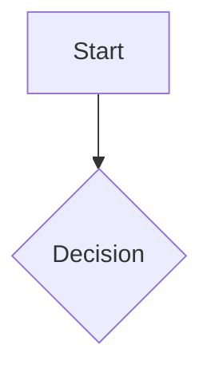

# obsidian (universal standard)

The shared, vault-agnostic standard for authoring Obsidian-flavored markdown, invoked as
`/obsidian`. It is named distinctly from any vault's own project-level `obsidian-md` skill so
the two never collide: both load, each adding its layer. Vault-specific skills layer their own
folder rules, naming, and protections on top of this; this file owns the universal syntax, the
render discipline, and the per-vault detect/probe/mirror workflow. Verified against
help.obsidian.md and Obsidian 1.9/1.10 release notes (2026-06-28).

Obsidian markdown is CommonMark plus GitHub-flavored extensions plus Obsidian-only syntax
(wikilinks, embeds, callouts, typed properties, block refs). The correct way to write in a given
vault depends on that vault's settings and existing conventions, so this skill is a workflow,
detect, probe, mirror, confirm, then author, not a fixed template.

## Core principle

**Mirror, don't invent.** Reuse the vault's existing property keys, tag taxonomy, callout types,
link style, folder layout, naming convention, and templates. When a convention is ambiguous,
prefer the vault's dominant observed pattern over the Obsidian default.

## Render target: Live Preview (always)

Author for **Live Preview / live editor mode**, the mode in use at all times; Reading view is
not used. Hard consequences:

- **No HTML comments (`<!-- -->`) and no raw HTML** for notes, guidance, or layout in authored
  content. They are invisible only in Reading view; in Live Preview they show as raw text and
  look broken. Use Obsidian-native constructs instead:
  - Boxed guidance or notices: **callouts** (`> [!note]`, `> [!warning]`, collapsible `> [!info]-`).
  - Inline hints: **italics** (`_like this_`).
- **Exception:** files a specific tool, agent, or template *explicitly requires* to carry
  HTML/comments. That exception stays in those files; never let it leak into ordinary notes.

## Workflow

### 1. Detect Obsidian context
Treat the work as Obsidian if any of these hold:
- An `.obsidian/` directory exists in the vault root (search up from the target file).
- The target `.md` lives inside a known vault.
- The user names Obsidian features (wikilinks, callouts, properties, vault, etc.).

If clearly a non-Obsidian repo (README, GitHub docs, no vault markers), defer to plain markdown
and do **not** emit wikilinks/callouts/embeds.

### 2. Auto-probe the vault (always, before authoring)
Run the read-only sweep in [references/VAULT-PROBE.md](references/VAULT-PROBE.md). It reads
`.obsidian/*.json`, samples recent notes, and builds an in-memory **vault profile**:

```
{ linkStyle, newLinkFormat, attachmentPath, strictLineBreaks,
  propertySchema, tagTaxonomy, enabledPlugins, dailyNoteFormat, templatePaths }
```

Treat missing `.obsidian` keys as their documented defaults
(`useMarkdownLinks=false` gives wikilinks, `newLinkFormat=shortest`, `strictLineBreaks=false`).

### 3. Report the profile plus an opinion, then WAIT
After probing, **stop and present** to the user:
- The detected vault profile (link style, property schema, tag taxonomy, enabled plugins,
  template/daily-note format).
- Your **recommendation** for how you'll author (e.g. "wikilinks, shortest path; properties
  `title/tags/created`; tags under `#area/...`; Dataview enabled so I'll use `key::` fields").
- Anything ambiguous or conflicting (e.g. app.json says markdown-links but notes use wikilinks).

Ask for confirmation, corrections, or approval. **Do not author content until the user
confirms.** This per-vault customization handshake is mandatory.

### 4. Author, conforming to the confirmed profile
Once approved, write content that obeys the profile. The quick reference below and the defaults
in the reference files apply only where the profile is silent.

## Top syntax (inline quick reference)

Full details live in the reference files; the most common forms:

**Frontmatter first**, must be line 1, valid YAML, plural reserved keys (1.9+):
```yaml
---
title: My Note
tags:
  - area/projects
aliases:
  - MN
created: 2026-06-25
---
```
Reserved keys are **plural lists**: `tags`, `aliases`, `cssclasses`. Internal links inside
frontmatter must be quoted: `related: "[[Other Note]]"`. See
[references/PROPERTIES.md](references/PROPERTIES.md).

**Linking rule**, `[[wikilinks]]` for in-vault notes (when `useMarkdownLinks=false`);
`[text](url)` for external URLs only:
```
[[Note Name]]
[[Note Name|Display Text]]
[[Note Name#Heading]]
[[Note Name#^block-id]]
[[#Heading in same note]]
```

> **Personal convention (this user - NOT stock Obsidian).** A note carries an
> **index tree** near the top: a nested list mirroring the document's heading
> hierarchy, where each entry links to a real **Markdown heading (any level H1–H5)**.
> Those *structural* headings that appear in the index tree are authored as
> **hyphenated tokens with no spaces** - `## EXTERNAL-RESOURCES`, `## tools-services-downloads`
> - so the index entry `[EXTERNAL-RESOURCES](#EXTERNAL-RESOURCES)` matches the heading
> literally: **no URL-encoding (`%20`), no GitHub slugs.** UPPERCASE-hyphenated for
> top-level landmarks (H1/H2); lowercase-hyphenated for nested sub-sections; the index
> tree's indentation mirrors the heading levels. Ordinary in-body content headers that
> are NOT index-tree nodes stay normal spaced prose and are not linked. (Stock forms
> still work - `[[#Heading]]` wikilink, or `[x](#Heading%20Text)` URL-encoded - but the
> token style is this user's default and sidesteps encoding.)

**Embeds / transclusion**, `!` prefix. See [references/EMBEDS.md](references/EMBEDS.md):
```
![[Note Name]]
![[Note Name#Heading]]
![[image.png|300]]
![[document.pdf#page=3]]
```

**Callouts**, `> [!type]`, `-`/`+` for foldable. Full list in
[references/CALLOUTS.md](references/CALLOUTS.md):
```
> [!note] Optional title
> Body supports **markdown**, [[links]], and ![[embeds]].

> [!warning]- Collapsed by default
> Hidden until expanded.
```

**Tags**, no space after `#`, nest with `/`, not purely numeric:
```
#area/projects   #status/in-progress   #tag-with-dashes
```

**Block reference**, `^id` (letters/numbers/hyphens only, no underscores) on its own line after
the block:
```
Important paragraph. ^key-point
```

**Math (MathJax, not KaTeX)**:
```
Inline: $e^{i\pi} + 1 = 0$
$$
\frac{a}{b} = c
$$
```

**Mermaid**:
~~~

~~~

**Footnotes**: `Text[^1]` then `[^1]: content`, or inline `^[note]`.

**Comments** (Obsidian-proprietary, hidden in Reading view): `%%inline%%` or block `%% ... %%`.

For full basic markdown (headings, lists, tasks, tables, escaping, line breaks) see
[references/SYNTAX.md](references/SYNTAX.md). For plugin-specific syntax (Dataview, Tasks,
Templater, Bases), emit only when detected, see [references/PLUGINS.md](references/PLUGINS.md).

## Portability (what breaks outside Obsidian)

Obsidian-only (degrade or vanish in generic markdown / GitHub): wiki-links `[[ ]]`, embeds
`![[ ]]`, block refs `^id`, highlights `==`, `%%` comments, and most callout types (only
note/tip/important/warning/caution overlap GitHub alerts; foldable `+/-` is Obsidian-only).
GFM-safe: headings, lists, code fences, tables, task lists, `~~strikethrough~~`, standard
`[label](url)` links. Use standard markdown links or HTML comments **only** when cross-tool
portability is the explicit goal, never in normal Obsidian authoring (see Render target).

## House style (cross-vault universals)

- No em dashes; use periods, commas, or colons.
- No user-name references anywhere; always "the user."
- `[[wiki-links]]` for in-vault references; standard `[label](url)` for external links.
- Per-vault structure (filename/H1 rules, folder protections, naming schemes) lives in the
  vault-specific skill, not here.

## Anti-patterns

- Singular frontmatter keys (`tag` / `alias` / `cssclass`); they silently fail in 1.9+.
- HTML comments or raw HTML for guidance in note content (invisible only in Reading view).
- Underscore in a block ID; `^id` at the end of a list line instead of its own line.
- Treating `==`, `[[ ]]`, or callouts as portable; they are Obsidian-only.
- KaTeX-only math macros (Obsidian is MathJax).
- Authoring before the vault probe and the user's confirmation.

## Index this vault

Trigger: **`/obsidian index`**, or "index this vault" / "rebuild the index" / "generate
INDEX.md". Run the bundled generator - one indexing method for every vault:

```
python3 scripts/index_vault.py            # auto-detects the vault (.obsidian upward, else CWD)
python3 scripts/index_vault.py --vault /path/to/vault
```

> A vault may ship its own wrapper welded to local automation (e.g. a vault-local index
> script driven by a launchd watcher + post-merge hook + tests, adding extras like
> date-frontmatter stamping). Where that exists, prefer it for that vault; this script is
> the portable standard and the reference implementation of the algorithm.

It writes `INDEX.md` at the vault root, a **meta-index** (a hub note, not just a file list):

- **gitignore parity + no dot folders** - in a git repo, files come from `git ls-files
  --cached --others --exclude-standard` (exactly the non-ignored set), so staging/build dirs
  (`_MERGE-PREVIEW/`, etc.) never leak in; non-git vaults fall back to a skip-folder walk.
  Dot folders / dotfiles (`.obsidian`, `.git`, `.claude`, `.trash`) are always excluded -
  Obsidian hides them, so they are not vault notes.
- **root first, then subfolders alphabetically (recursive)** - deterministic ordering.
- **per-file header tree** - under each `[[file]]`, its section headers nest as
  `[[file#Heading|Heading]]` wiki-links (4-space indent per level). This deep-links every
  section and makes INDEX a hub in the graph view. Convention-agnostic (any heading style),
  fence-aware, drops the H1 title. Flags: `--no-trees`, `--tree-exclude a,b`, `--max-headings N`.

Header-tree convention this encodes: a file's landmark section headers are treated as
**taxonomic children of the filename** - so the index mirrors the file → section hierarchy.
Vaults that adopt hyphenated-token headings (no spaces) get the cleanest wiki-link anchors,
but the generator handles prose headings too. A vault-specific skill may wrap this with its
own skip folders or date-stamping; the method above is the shared standard.

### Anchors that survive both Obsidian and a git host

A note that lives in a vault **and** ships to GitHub, Azure DevOps or GitLab has to satisfy two
incompatible anchor rules at once. Obsidian matches an in-file markdown anchor against the
heading text **literally**, so a spaced heading needs `%20` encoding. Git hosts slugify instead:
lowercase, punctuation stripped, spaces to hyphens.

A **hyphenated-token heading is the fixed point of both.** `## 4-choosing-the-load-strategy`
slugifies to `4-choosing-the-load-strategy` (already lowercase, already hyphenated, nothing to
strip) and matches literally in Obsidian, so a single plain anchor works in both renderers:

```markdown
## 4-choosing-the-load-strategy
[4-choosing-the-load-strategy](#4-choosing-the-load-strategy)
```

Every other combination breaks on one side. A spaced heading needs `%20` for Obsidian, which a
git host will not resolve; a git-style slug against a spaced heading fails in Obsidian; and a
wiki-link anchor is meaningless outside a vault.

**Tokenize only the headings the index links to.** Deeper in-body headings stay spaced prose and
stay unlinked, which keeps the document readable for someone who is reading rather than
navigating.

**Prefer lowercase tokens everywhere.** A git host lowercases when it slugifies, so an
`UPPERCASE-TOKEN` heading matches in Obsidian and dies on publish, while a lowercase one works in
both. Lowercase is therefore the default for any new index-tree heading, not merely the option
for notes that ship: a note nobody planned to publish is the one that later gets published.

Uppercase landmark tokens remain correct where a vault's existing template already established
them. Grandfather those rather than sweeping them, and do not mix the two inside one document
set.

**Cap a token heading at five hyphen-separated tokens and forty characters**, whichever binds
first, counting a number prefix as a token. `4-choosing-the-load-strategy` is five tokens and
twenty-eight characters. The cap is what keeps an index scannable: entries of wildly different
lengths read as a ransom note, and a heading needing eight tokens is describing a section that
wants splitting or renaming.

### Structural conventions for indexed documents

These apply where a vault or document set has adopted an index tree. They are conventions to
confirm against the vault profile, not defaults to impose on a vault that does not use them.

- **The index nests to mirror the real heading hierarchy**, one indent level per heading level.
  A flat index over a nested document hides the structure it exists to expose.
- **The index list opens immediately under its heading**, with no blank line between them.
- **A horizontal rule precedes every `##` except the first.** Sections are what a reader scrolls
  between, so the break needs to be visible without reading the heading. Subsections take none.
- **Exactly one trailing newline** at end of file.

Each of these is mechanically checkable, so a document set that adopts them should be checked
rather than eyeballed: anchors resolving, headings slug-stable, headings inside the cap, rules
before each section, and the trailing newline.

## Verification

- [ ] Vault probed and the profile confirmed with the user before authoring.
- [ ] Frontmatter uses plural list keys and opens on line 1.
- [ ] In-vault refs are wiki-links; external are standard markdown.
- [ ] No raw HTML or HTML comments in authored note content (Live Preview target).
- [ ] Math is MathJax-compatible; no em dashes; no user-name references.

## Reference files
- [VAULT-PROBE.md](references/VAULT-PROBE.md): the per-vault detection procedure (run first).
- [SYNTAX.md](references/SYNTAX.md): full basic markdown reference.
- [PROPERTIES.md](references/PROPERTIES.md): YAML property types, reserved keys, 1.9 rules.
- [CALLOUTS.md](references/CALLOUTS.md): all callout types, foldable, nesting, custom CSS.
- [EMBEDS.md](references/EMBEDS.md): notes/images/audio/PDF/Bases/lists, sizing.
- [PLUGINS.md](references/PLUGINS.md): Dataview / Tasks / Templater / Bases (gated on detection).
- [scripts/index_vault.py](scripts/index_vault.py): the vault meta-index generator (see "Index this vault").

## Tests

`tests/test_skill.py` is a dependency-free (stdlib only) check of this skill's structure and
content invariants: run `python3 tests/test_skill.py` from the skill root after any edit.
